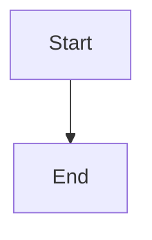

# Content Specification -- Glintstone

Complete authoring reference for course content in the Glintstone content engine.

## File Structure

Content lives in `clase/` directory. Files are Markdown with optional YAML frontmatter.

### Naming Conventions

| Prefix | Meaning | Nav Display | Example |
|--------|---------|-------------|---------|
| `00_` | Section index | Hidden from nav (parent shows) | `00_index.md` |
| `01_`, `02_` | Numbered content | 1, 2, ... | `01_intro.md` |
| `a_`, `b_` | Appendix sections | A, B, ... | `a_apendice/` |
| `z_` | Documentation | Z (sorted last) | `z_docs/` |
| `??_` | Work in progress | Excluded from build | `??_draft/` |

### Directory Structure

```
clase/
├── 00_index.md          # Root index (optional)
├── 01_chapter_name/
│   ├── 00_index.md      # Chapter index
│   ├── 01_topic.md      # Content page
│   ├── 02_topic.md
│   └── images/          # Chapter images
├── 02_chapter_name/
│   └── ...
├── a_appendix/
│   ├── 00_index.md
│   └── 01_reference.md
└── calendario_temas.csv # Optional calendar
```

## Frontmatter

Optional YAML frontmatter between `---` delimiters.

```yaml
---
title: "Page Title"           # Displayed in nav and header
summary: "Brief description"  # Used in chapter index cards
tags: [python, data]          # For categorization
layout: layouts/base.njk      # Default, usually omit
---
```

### Required Fields

None. All fields are optional. If `title` is omitted, it's generated from the filename.

### Available Fields

| Field | Type | Default | Description |
|-------|------|---------|-------------|
| `title` | string | From filename | Page title |
| `summary` | string | null | Brief description for index cards |
| `tags` | list | [] | Categorization tags |
| `layout` | string | `layouts/base.njk` | Template to use |
| `order` | number | From filename prefix | Sort order override |
| `eleventyExcludeFromCollections` | boolean | false | Exclude from nav |

## Components

Eight component types, rendered as styled blocks with headers and badges.

### Syntax

```markdown
:::type{key="value" key2="value2"}

Content here (markdown supported).

:::
```

**IMPORTANT:**
- Opening `:::type{...}` MUST be on its own line
- Closing `:::` MUST be on its own line (just three colons, nothing else)
- Attributes use `key="value"` syntax (double quotes required)
- Content between markers is rendered as markdown

### Component Types

#### homework
```markdown
:::homework{id="tarea-01" title="Task Name" due="2026-03-01" points="10"}
Instructions here.
:::
```
| Attr | Required | Description |
|------|----------|-------------|
| `id` | Yes | Unique identifier (aggregated to task pages) |
| `title` | Yes | Display name |
| `due` | No | Due date (YYYY-MM-DD format) |
| `points` | No | Point value |

#### exercise
```markdown
:::exercise{title="Exercise Name" difficulty="2"}
Instructions here.
:::
```
| Attr | Required | Description |
|------|----------|-------------|
| `title` | Yes | Display name |
| `difficulty` | No | 1-5 (displayed as stars) |

#### prompt
```markdown
:::prompt{title="Prompt Name" for="ChatGPT"}
Your prompt text here.
:::
```
| Attr | Required | Description |
|------|----------|-------------|
| `title` | Yes | Display name |
| `for` | No | Target AI tool |

#### example
```markdown
:::example{title="Example Name"}
Example content here.
:::
```
| Attr | Required | Description |
|------|----------|-------------|
| `title` | Yes | Display name |

#### exam
```markdown
:::exam{id="parcial-01" title="Exam Name" date="2026-03-15" location="Room 101" duration="2h"}
Exam details here.
:::
```
| Attr | Required | Description |
|------|----------|-------------|
| `id` | Yes | Unique identifier |
| `title` | Yes | Display name |
| `date` | No | Exam date (YYYY-MM-DD) |
| `location` | No | Physical location |
| `duration` | No | Time allowed |

#### project
```markdown
:::project{id="proj-01" title="Project Name" due="2026-05-01" points="100"}
Project description here.
:::
```
| Attr | Required | Description |
|------|----------|-------------|
| `id` | Yes | Unique identifier |
| `title` | Yes | Display name |
| `due` | No | Due date (YYYY-MM-DD) |
| `points` | No | Point value |

#### quiz
```markdown
:::quiz{title="Concept Check"}

- [ ] Incorrect option
- [x] Correct option
- [ ] Another incorrect option

:::
```
| Attr | Required | Description |
|------|----------|-------------|
| `title` | Yes | Display name |

The quiz transforms checkbox lists into interactive clickable options. Items marked with `[x]` are correct answers. Clicking reveals correct/incorrect feedback and a "Reintentar" (retry) button.

#### embed
```markdown
:::embed{src="https://www.youtube.com/embed/VIDEO_ID" title="Video Tutorial"}
Optional caption text.
:::
```
| Attr | Required | Description |
|------|----------|-------------|
| `src` | Yes | URL for the iframe |
| `title` | No | Display name and iframe title |
| `type` | No | Resource type hint |

Renders a responsive 16:9 iframe. Use for YouTube videos, Google Slides, or any embeddable resource.

## Slide Generation

Add `slides: true` to a page's frontmatter to generate a reveal.js presentation:

```yaml
---
title: "My Lecture"
slides: true
---
```

The build splits content on `##` headings to create individual slides. Run `docker compose up slides` to generate HTML presentations in `_site/slides/`.

## Math (KaTeX)

### Inline Math
Use single dollar signs: `$E = mc^2$`

### Display Math
Use double dollar signs on their own lines:
```
$$
\int_0^\infty e^{-x^2} dx = \frac{\sqrt{\pi}}{2}
$$
```

### Important Notes
- `$5` by itself is NOT math (dollar followed by digit)
- `--` is NOT converted to en-dash (typographer disabled)
- Math inside code blocks is not rendered

## Mermaid Diagrams

Use fenced code blocks with `mermaid` language:

````markdown

````

Diagrams automatically adapt to the current theme colors.

## Images

Place images in an `images/` subdirectory of the current chapter:

```markdown

```

Image paths are automatically resolved during build. Supported formats: PNG, JPG, GIF, SVG, WebP.

## Links

### Internal Links
Link to other markdown files using relative paths:

```markdown
[Link text](./other_file.md)
[Link to other chapter](../02_chapter/01_topic.md)
```

`.md` extensions are automatically converted to clean URLs during build.

### External Links
Standard markdown links:

```markdown
[Google](https://google.com)
```

## Date Format

All dates in component attributes must use `YYYY-MM-DD` format:
- Correct: `due="2026-03-15"`
- Wrong: `due="March 15, 2026"`
- Wrong: `due="15/03/2026"`

## DO and DON'T

### DO
- Use `00_index.md` for every directory
- Use consistent numbering (01_, 02_, 03_)
- Put images in `images/` subdirectories
- Use YYYY-MM-DD for dates
- Give unique IDs to homework, exam, and project components
- Close every `:::component` with `:::`

### DON'T
- Don't skip numbers (01_, 03_ -- where is 02_?)
- Don't use spaces in filenames
- Don't use uppercase in filenames
- Don't put absolute paths in links
- Don't duplicate component IDs
- Don't use `$` for currency (use USD or write "dollars")
