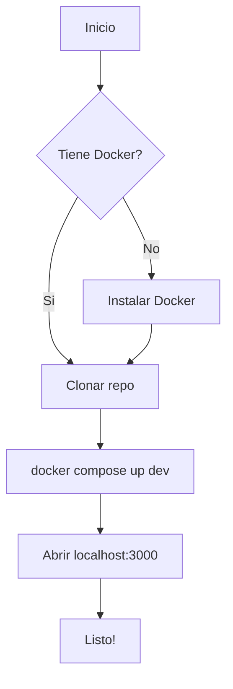
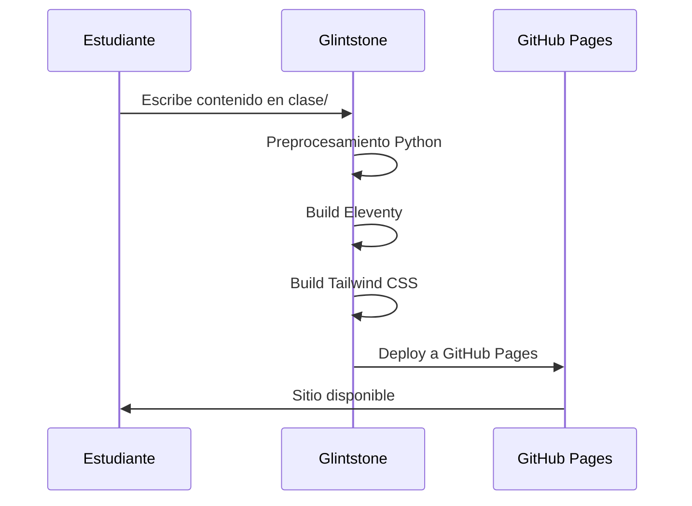
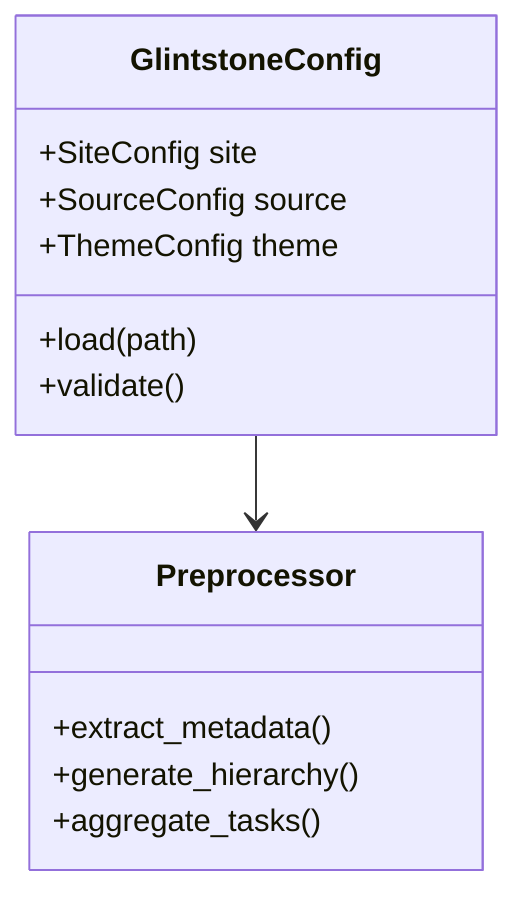
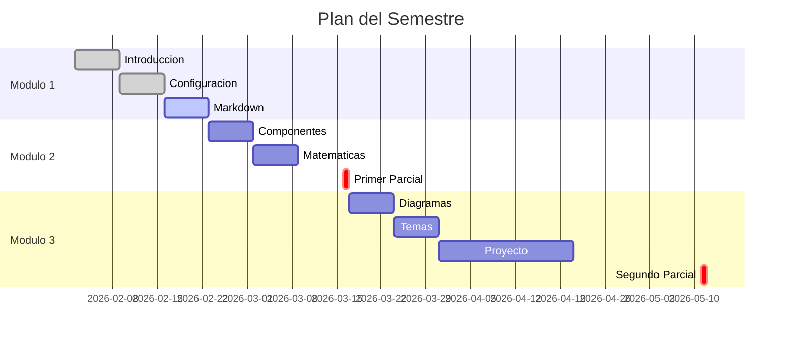

# Diagramas con Mermaid

## Diagrama de Flujo

## Diagrama de Secuencia

## Diagrama de Clases

## Diagrama de Gantt

:::example{title="Tip: Mermaid y Temas"}

Los diagramas de Mermaid se adaptan automaticamente al tema seleccionado.
Prueba cambiar entre los temas usando el boton en la barra lateral.
Haz click en cualquier diagrama para verlo en pantalla completa.

:::
