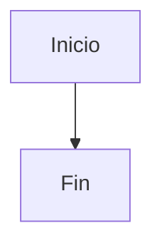
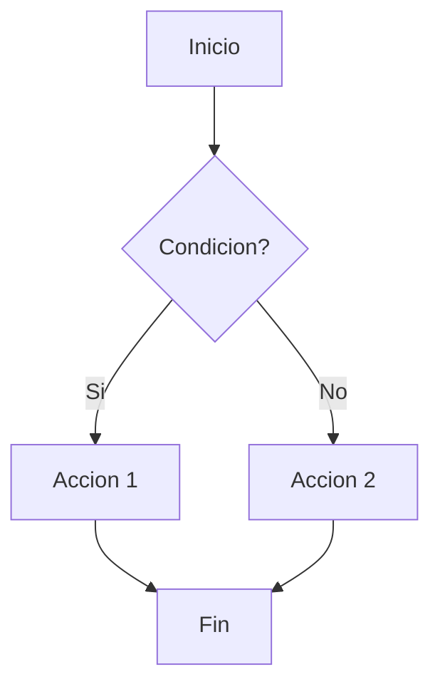
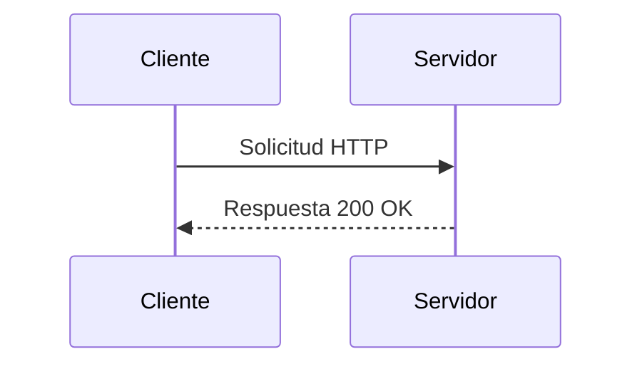
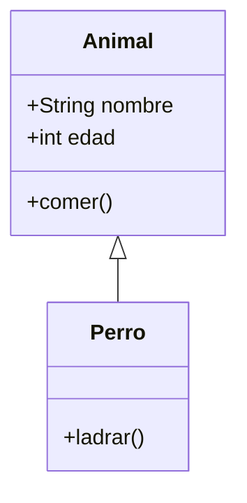
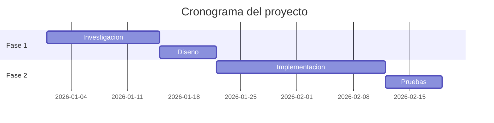

# Diagramas

El sitio soporta diagramas usando [Mermaid](https://mermaid.js.org/), que genera graficos a partir de texto.

## Sintaxis

Usa un bloque de codigo con el lenguaje `mermaid`:

````markdown

````

## Tipos de diagramas

### Diagrama de flujo

````markdown

````

### Diagrama de secuencia

````markdown

````

### Diagrama de clases

````markdown

````

### Diagrama de Gantt

````markdown

````

## Adaptacion al tema

Los diagramas se adaptan automaticamente a los colores del tema activo. No necesitas configurar colores manualmente.
