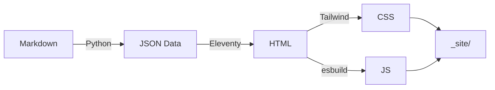

# Showcase de Raya Lucaria

Esta pagina demuestra todas las funcionalidades del framework Raya Lucaria.

## Texto y Formato

Texto normal, **negritas**, *italicas*, ~~tachado~~, y `codigo en linea`.

> Esta es una cita. Las citas se formatean automaticamente con un borde lateral usando el color de acento del tema activo.

### Listas

**Lista desordenada:**

- Primer elemento
- Segundo elemento con `codigo`
- Tercer elemento con **negritas**

**Lista ordenada:**

1. Paso uno
2. Paso dos
3. Paso tres

### Tabla

| Componente | Tipo | Color |
|-----------|------|-------|
| Tarea | homework | naranja |
| Ejercicio | exercise | azul |
| Prompt | prompt | morado |
| Ejemplo | example | gris |
| Examen | exam | rojo |
| Proyecto | project | dorado |
| Quiz | quiz | esmeralda |
| Embed | embed | cian |

### Codigo

```python
def fibonacci(n: int) -> list[int]:
    """Genera los primeros n numeros de Fibonacci."""
    fib = [0, 1]
    for i in range(2, n):
        fib.append(fib[i-1] + fib[i-2])
    return fib[:n]

if __name__ == "__main__":
    print(fibonacci(10))
```

```javascript
// Ejemplo en JavaScript
const greet = (name) => `Hola, ${name}!`;
console.log(greet("glintstone"));
```

### Enlaces

- Enlace interno: [Bienvenida](../../01_primeros_pasos/01_bienvenida/)
- Enlace a seccion: [Matematicas](../03_matematicas/)

---

## Matematicas

Formulas en linea: $E = mc^2$ y $\nabla \times \mathbf{E} = -\frac{\partial \mathbf{B}}{\partial t}$.

Formula en bloque:

$$\int_0^\infty \frac{x^{s-1}}{e^x - 1} dx = \Gamma(s) \zeta(s)$$

---

## Diagrama



---

## Los 8 Componentes

:::homework{id="tarea-showcase" title="Tarea de Ejemplo" due="2026-06-01" points="15"}

Esta es una **tarea** de ejemplo. Las tareas aparecen en la pagina `/tareas/` automaticamente.

- Paso 1: Leer la documentacion
- Paso 2: Completar el ejercicio
- Paso 3: Entregar antes de la fecha limite

:::

:::exercise{title="Ejercicio de Practica" difficulty="3"}

Los ejercicios son para practica y no tienen fecha de entrega.

Resuelve: $\sum_{k=1}^{n} k^2 = \frac{n(n+1)(2n+1)}{6}$ para $n = 10$.

:::

:::prompt{title="Pregunta de Reflexion"}

Explica en tus propias palabras: ?`por que es importante la notacion matematica formal en ciencias de la computacion?

:::

:::example{title="Ejemplo Ilustrativo"}

Los bloques de ejemplo son utiles para mostrar soluciones o patrones:

```python
# Patron Observer en Python
class EventEmitter:
    def __init__(self):
        self._listeners = {}

    def on(self, event, callback):
        self._listeners.setdefault(event, []).append(callback)

    def emit(self, event, *args):
        for cb in self._listeners.get(event, []):
            cb(*args)
```

:::

:::exam{id="parcial-ejemplo" title="Examen Parcial de Ejemplo" date="2026-04-15" location="Salon 101" duration="2 horas" points="100"}

Este es un bloque de tipo examen. Los examenes aparecen en la pagina `/examenes/`.

**Temas incluidos:**
- Estructuras de datos
- Algoritmos de ordenamiento
- Complejidad computacional

:::

:::project{id="proyecto-ejemplo" title="Proyecto Final de Ejemplo" due="2026-05-20" points="200"}

Los proyectos son asignaciones de largo plazo. Aparecen en `/proyectos/`.

**Entregables:**
1. Propuesta del proyecto
2. Codigo fuente en repositorio
3. Presentacion final

:::

:::quiz{title="Verificacion de Conceptos"}

- [ ] Python es un lenguaje compilado
- [x] Python es un lenguaje interpretado
- [ ] Python no soporta orientacion a objetos
- [x] Python soporta multiples paradigmas

:::

:::embed{src="https://www.youtube.com/embed/dQw4w9WgXcQ" title="Video Tutorial de Ejemplo"}

Este es un ejemplo de recurso embebido. El iframe se ajusta responsivamente al ancho disponible.

:::
