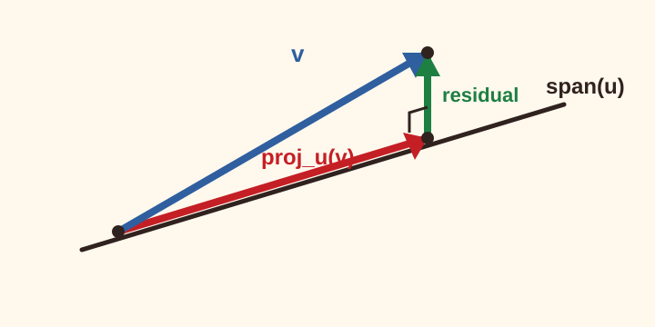

# Projection Residuals

What remains after projecting a vector onto a line? This short lesson uses that
question to exercise the reader shell, learning rail, numbered objects,
MathJax, local assets, and support disclosures in one realistic page.

> [!TIP]
> **Try this first.** Imagine shining a light from $v$ onto the line through
> $u$. The shadow is the projection. Predict what direction the leftover vector
> should point before reading the formula.

> [!WARNING]
> **Misconception.** A residual that looks perpendicular in a drawing is not
> enough. Orthogonality is checked by an inner product equal to zero.

We work in $\newcommand{\vect}[1]{\mathbf{#1}}\newcommand{\ip}[2]{\left\langle #1,#2\right\rangle}\newcommand{\orthproj}{\operatorname{proj}}\mathbb{R}^3$ with the standard inner product. The running question is how a vector splits into a component along a line and a residual component perpendicular to it.

::: definition {#orthogonal-definition title="Orthogonal residual"}
Let $u$ be a nonzero vector. The residual of $v$ after projection onto
$\operatorname{span}\{u\}$ is
$v-\orthproj_u(v)$, where

$$
\orthproj_u(v)=\frac{\ip{v}{u}}{\ip{u}{u}}u.
$$

The residual is orthogonal to $u$ when its inner product with $u$ is zero.
:::

::: proposition {#orthogonal-proposition title="Projection residual is orthogonal"}
For every nonzero $u\in\mathbb{R}^n$ and every $v\in\mathbb{R}^n$, the vector
$v-\orthproj_u(v)$ is orthogonal to $u$.
:::

::: proof {#proof-orthogonal-proposition of="orthogonal-proposition"}
Compute the inner product directly:

$$
\ip{v-\orthproj_u(v)}{u}
=
\ip{v}{u}
-
\frac{\ip{v}{u}}{\ip{u}{u}}\ip{u}{u}
=0.
$$

So the residual has no component in the direction of $u$.
:::

::: corollary {#orthogonal-split}
The decomposition $v=\orthproj_u(v)+(v-\orthproj_u(v))$ separates $v$ into a
part parallel to $u$ and a part orthogonal to $u$.
:::

::: remark {#orthogonal-remark}
The word orthogonal is stronger than visually perpendicular on a drawing. It is
defined by the inner product, so the same reader-facing layout can carry both a
short concept check and a math-heavy calculation.
:::

::: example {#orthogonal-example title="A two-coordinate projection"}
Let

$$
u=
\begin{bmatrix}
1\\
1
\end{bmatrix},
\qquad
v=
\begin{bmatrix}
3\\
1
\end{bmatrix}.
$$

Then $\ip{v}{u}=4$ and $\ip{u}{u}=2$, so

$$
\orthproj_u(v)=
2
\begin{bmatrix}
1\\
1
\end{bmatrix}
=
\begin{bmatrix}
2\\
2
\end{bmatrix}.
$$

The residual is $\begin{bmatrix}1\\-1\end{bmatrix}$, whose dot product with
$u$ is $0$.
:::

## Worked Example

Split the vector using the computation above: find the projection, subtract it
from the original vector, and check the dot product of the residual with the
direction vector.

## 1 Numeric Heading

Use this numeric heading as a quick navigation target. The course shell should
keep the current heading visible in the page contents while the math below stays
readable.

::: equation {#orthogonal-equation}
$$
v =
\frac{\ip{v}{u}}{\ip{u}{u}}u
+
\left(v-\frac{\ip{v}{u}}{\ip{u}{u}}u\right)
$$
:::

::: figure {#orthogonal-figure title="Projection triangle"}

:::

::: table {#orthogonal-table title="Projection checklist"}
| Step | Quantity | Check |
| --- | --- | --- |
| Parallel component | $\orthproj_u(v)$ | scalar multiple of $u$ |
| Residual component | $v-\orthproj_u(v)$ | inner product with $u$ is $0$ |
| Reconstruction | sum of both components | equals $v$ |
:::

::: problem {#orthogonal-problem}
For $u=\begin{bmatrix}2\\1\end{bmatrix}$ and
$v=\begin{bmatrix}1\\4\end{bmatrix}$, compute $\orthproj_u(v)$ and verify the
residual is orthogonal to $u$.
:::

## Orientation Checkpoint

> [!TIP]
> Before moving on, use the course map and learning rail to identify this page,
> its prerequisite, and the next page in the static sequence.

## Static Practice Prompt

::: problem {#reader-map-practice title="Reader map practice"}
Use the course map and learning rail to name this page, its prerequisite, and
the next page linked from the map.
:::

::: hint {#hint-reader-map-practice of="reader-map-practice"}
Start with the learning rail, then compare it with the left-side course map.
:::

::: answer {#answer-reader-map-practice of="reader-map-practice"}
This page is Projection Residuals, its prerequisite is Raya Lucaria Render
Fixture, and the next map page is Authoring Matrix Fixture.
:::

::: activity {#orthogonal-activity title="Check the residual"}
Use @orthogonal-equation to explain why changing the length of $u$ without
changing its direction does not change the projection line. Then compare your
calculation with @orthogonal-example.
:::

::: hint {#hint-orthogonal-activity of="orthogonal-activity"}
Compare the projection formula for $u$ and $cu$ before expanding the matrix product.
:::

::: solution {#solution-orthogonal-activity of="orthogonal-activity" title="Matrix check"}
Take

$$
u=
\begin{bmatrix}1\\0\end{bmatrix},
\qquad
2u=
\begin{bmatrix}2\\0\end{bmatrix},
\qquad
v=
\begin{bmatrix}2\\3\end{bmatrix}.
$$

Scaling the direction vector changes the projection coefficient while the
projection line stays fixed. The projection onto the scaled direction is

$$
\orthproj_{2u}(v)
=
\frac{\ip{v}{2u}}{\ip{2u}{2u}}(2u)
=
\frac{4}{4}
\begin{bmatrix}2\\0\end{bmatrix}
=
\begin{bmatrix}2\\0\end{bmatrix},
$$

the same parallel component as $\orthproj_u(v)$. The residual vector is

$$
\begin{bmatrix}2\\3\end{bmatrix}
-
\begin{bmatrix}2\\0\end{bmatrix}
=
\begin{bmatrix}0\\3\end{bmatrix},
$$

so the inner product with either direction vector is $0$.
:::

::: answer {#answer-orthogonal-activity of="orthogonal-activity"}
Scaling $u$ by a nonzero constant changes the parameterization, not the
projection line. The residual vector is orthogonal to the direction vector.
:::

::: hint
Standalone hints can support reading without creating a numbered object.
:::

::: proof {of="orthogonal-activity" title="Solution sketch of Activity 4.1"}
Replacing $u$ by $cu$ changes both $\ip{v}{u}$ and $\ip{u}{u}$ by matching
factors, so the scalar multiple still points along the same line. The residual
check remains the inner-product calculation from @orthogonal-proposition.
:::

## Fixture Note

This remains reader-facing fixture material for renderer, browser, and
render-debug checks. It is not canonical pedagogy; fixture authority remains in
`docs/foundation/`.
